# The Greenbank Pub Website

## Welcome to the Greenbank Pub!

This project was created for my first milestone project with code institutes Level 5 Diploma in Web Application Development. I have chosen to create this fiction website since I actually personally work at this pub and thought it would be a good base for my first project- as well as lending to ample indivisuals to test and gain feedback from. 

[Visit the Greenbank live webiste here](https://beng-brown.github.io/the-greenbank-pub/)

## Contents 

### User Expereince Contents
- purpose/ user stories, first time, returning, frequent

### Design 
- color
- imagery
- figma/wire frame

### Features 
- index/home
- food page
- loyalty sign up section
- booking form
- booking page

### Languages & technologies used
- programs used
- websites and other sources

### Testing

- testing all the functions and links
- user story testing 
- lighthouse results, mobile and desktop
- validator checks css and html
- any bugs and fixes ive done

### deployment

 

---

 

# User Experience

## Purpose

This website is for the Greenbank Pub- I have set out to create an easily navigated website built with the purpose of advertising to new potential customers and offering more information on people wanting to visit and book into the establishment. 
 
 This website is aimed at a large general audiance to offer easily obtained information on our opening times, food and drinks offerings etc. As well as giving the option to contact us in regards to bookings or other enquires. With the aim of making the requesting more informationa and booking process and quick and painless as possible. 

 The plan was to make the site as easily navigatable and understandable for people of all ages and walks of life. The design of the site reflects this with keeping it simple yet visually attractive.

 ## User Stories

 ### Client Goals

- To be imedietly obvious that this is a hospitality business- with the name and relevent pictures this is imedietly apparent.
- To traffic more trade to the venue in the way of bookings. Offering a simple form to make a reservations/ask for more info.
-To be responsive and able to view on all devices.
- simple navigation and access to food/drink menus. 
- Contact details and where to find us as well as social media links.

 ### First time Visitor Goals

 - I want to find out the location of the pub and its opening hours for drinks and food.
 - I want to be able to see the menus to make sure I want to eat/drink there.
 - I want to gain a sence of what the pub is like through attractive pictures of the place its self and its offerings.
 - lastly I would like to book a table simply and quickly. 

 ### Second Time Visitor Goals

 - I would like access to the recent menus and opening times etc in case anything has chanaged.
 - I would like to be able to book a table quick and easily.
 - I would like to be able to be able to find easily contact information for any further questions I may have.

 ### Multiple Visitor Goals

 - I would like to access the menus.
 - I would like to book a table.
 
 

# Design

## Colour Scheme

I created a pallete using the site 	[Coolers ](https://coolors.co/). I choose to go with a Green theme for obvious reasons. Creating a nice earthy, soothing colors which also offered great contrast. Ideal for highlighting headers, defining sections and other important infomation.  

 

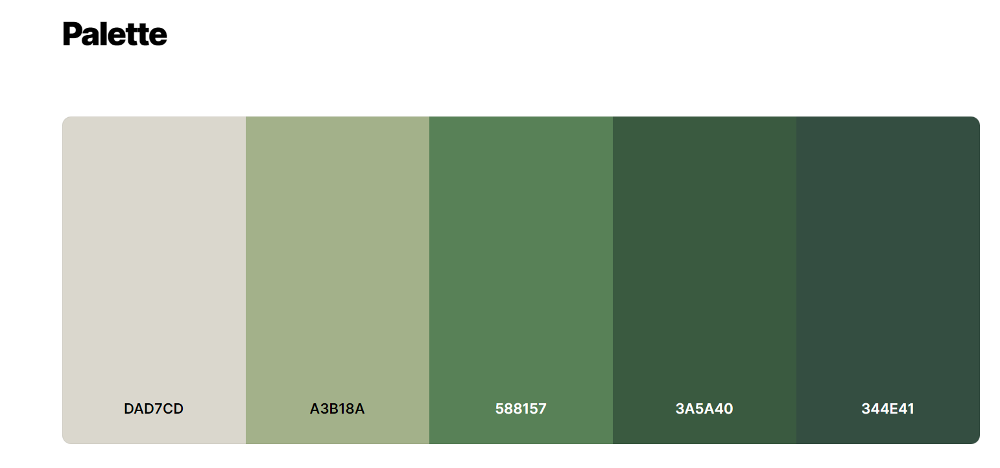
 
  

## Fonts

I used [Google Fonts](https://fonts.google.com/) for my webpage fonts. I settled with 'Inter' I really liked this font it was nice and readable for accesability reasons. It also came with a range of weights, which ment after some playing around I only needed the one font. With the added weight it gave great contrast between headers and areas of text. I feel it complimented site really well. I also used the back up as san-serif.

## Wireframes and Structure

I used [Figma](https://www.figma.com/) to create some previews of what I envisioned my site to look like. This was a great tool, as even though my finished project does stray slightly to the orginal plan, fimga allowed me to already have my fonts, color schemes and general layout of the site ready to code. This being my first project benifited my enormiously. 
 

### Wireframe screenshots:

Desktop

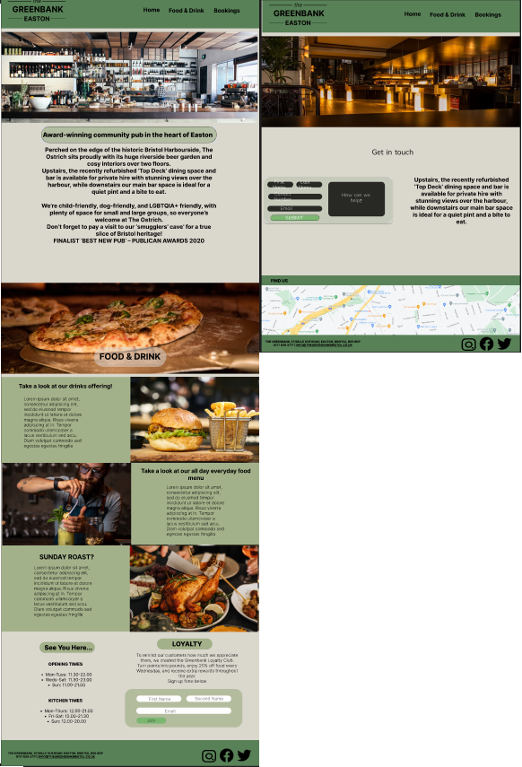

Mobile

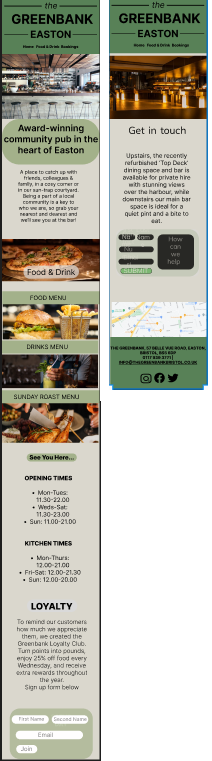

 
As you can see, during the coding process I created another page and moved the food & drink section over. I chose to do this as  felt the page was slightly conjested and it made room for a small gallery on the index page.

The sites structure comprises of 

- A Home page
- Food & Drinks page
- Booking Page

## Features

**ALL** the pages contain the same header and footer. And follow the same pattern of having a hero image placed just below. There are also alternative links thoughout the pages offering the vister to continue their journey through the site without having to scroll back to the top. There is also a small "back to the top button" on each page to add to better user experience.

The suggested journey would be Index > Food & Drink > Booking. 

**Header**- The header comprises of two parts 1) being the logo which I created myself using figma and then exporting it. 2) Being the navigation links on the opposite side. Giving a smiple but smart apperance. 

As shown below in desktop and then mobile sized screens. On smaller screens the navigation links shift to beneith the logo. Allowing for greater asetics, user experence and showing repsonsive design.  

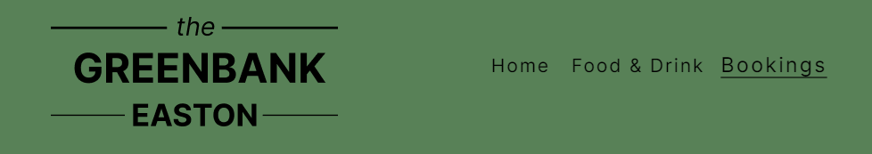
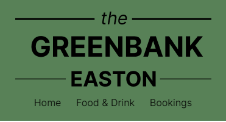
 

**Footer**- The footer also follows a similar template however instead of a logo there is the address and the contact details of the venue. Followed on the otherside by social media links. 

Similarly to the header this also folds when on smaller screensizes. For the same reasons as above. 

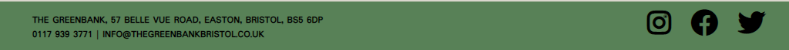
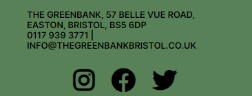
 

### Home Page

The home page comprises of 3 sections the first being a hero image followed by an "about" paragraph giving a breif background on the pub. We then have a gallery consisting of 6 images & finally followed by a section about our customer loyalty scheme inc a sign up form and our pub/kicthen opening times.

All pictures and text have been carefully placed and picked so that it is obvious that this page is for a pub/restaraunt.

### Food & Drinks Page
The food & Drink page also follows in a similar mannor, having a large hero img and some text about what we offer. 

Beneath this we have our menu section. With links to the PDF menu tied to the pictures. These also scale 1:2 when hovered over, which is a nice touch to draw attention. However this wouldnt work with mobile sizes and would offer a poor UX as shown below it is coded to be responive and take up less space. The hover is ignored and the text bos is hidden-on smaller screens.

Menus on Desktop

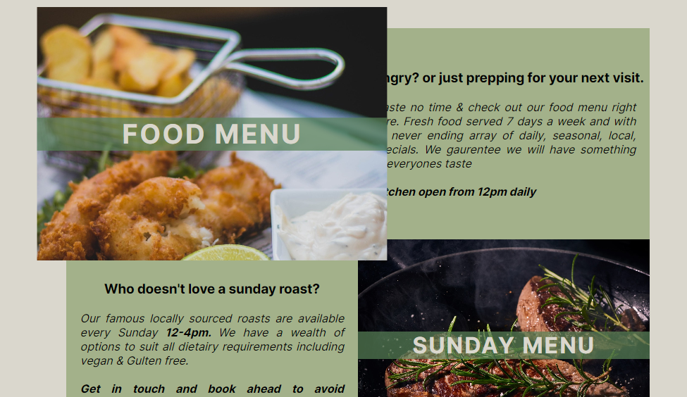

Menus on Mobile

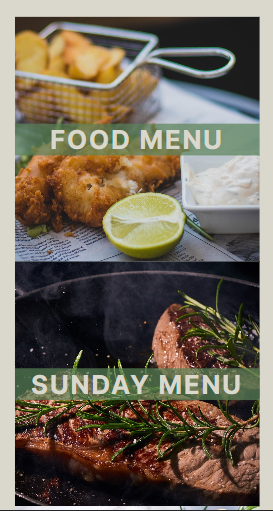

 

### Booking Page

The booking page comprises of a large booking form beneath text about options in regards to booking, private function/table reservations etc. 
This is followed by 4 responsive reviews and an iframe containing a google map of where the Greenbank Pub is situated. 

Booking Form

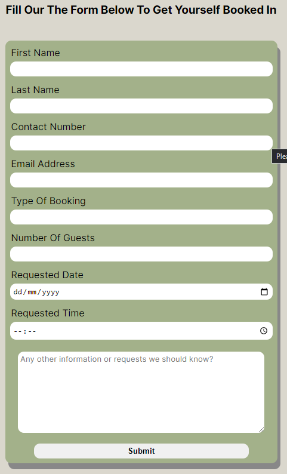

iframe/reviews section

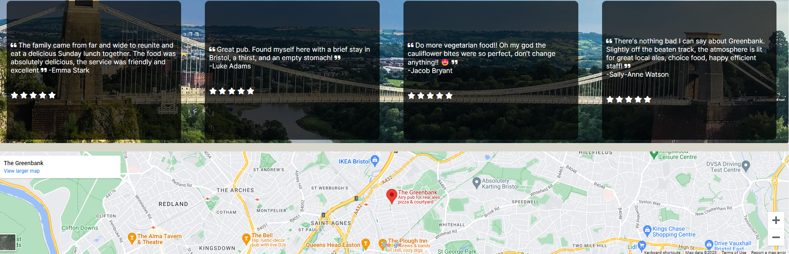

 

### Future Additional Features

One main thing I would love to add in the future when I have further developed throughout this course would be a fully functional take away menu along with an interactive and updatable events/whats on listing page. 

# Technologies 

## Languages
CSS & HTML 

## Tools

- Github- Storing and hosting my code
- Gitpod- Code Editor, create, edit and preview my code
-  Git- Used for version control
- Google Dev Tools- Used to test responsivness on different screens & layout etc
- Figma- Used to create and develop my previews inc fonts, colors, images etc
- Fontawsome- Sourced my icons, including the social media in footer
- Hover.css- Database of CSS3 powered hover effects to be applied to links, buttons
- Coolers- Used to create and pick my color scheme
- Pexels= Stock images used throughout my project
- Am I Responsive-  To create a preview of my website across different devices
- W3C CSS Validation Service-  Online validator used to validate my CSS code
- W3C Markup Validation Service- Online validator used to validate my HTML code
- Color Contrast Acessibility Validator- Used to check the color scheme in regards to contrast of fonts and background colors. 

 

# Testing

## User Story Testing 

 

| **First Time Visitor Goals** | **Solution** | **Outcome** |
| ---| ---| ---|
|Gain a sence of what the pub is like through attractive pictures of the place its self and its offerings | First thing you are drawn to on the home page is the logo, large hero image & "about" text giving a sence of what the pub and the page is about. | Achieved |
| Easily visible and direct route to the online Menus and openning hours| Several ways, the nav bar on top of every page has a link named "food & Drink" providing an imediate route to the section. There is also another button placed just after the home page gallery named "check out our menus" | Achieved|
| Opening hours and address easily identifed| The opening hours can be found near the bottom of both the home & food pages. The address and other contact details can be found in the footer on every page. There is also an Iframe containing google maps directions | Achieved|
| Navigate to and easily book a table/function | On the nav bar present on each page there is a clearly marked "booking" link which will take you directly to our booking page containing the form, there is also another button placed on both the home and food pages "want to make a booking" to save scrolling back to the top and creating a better and more direct user experience | Achieved |

 

| **Multiple Time Visitor Goals** | **Solution** | **Outcome** |
| ---| ---| ---|
|Access to the recent menus and opening times etc in case anything has chanaged| On the nav bar present on each page there is a clearly marked "food & Drink" link which will take you directly to our booking page containing the menus, provding simple and efficent access to the information you want. | Achieved |
|I would like to be able to book a table quick and easily| Similarly to the above the "booking" link is at the top of every page creating a direct link stright to the booking page. | Achieved |
| Entised to Links of our social media, for mroe regular goings on & increase pub interaction/ following | On the footer of each page I have used font awsome icons to make clear and unmissable links to our socials. | Achieved |

 

## Summary

Overal this website is easily navigated for both the first time and multiple visitors. With clear and obvious links taking the user directly to were they need to go. Or a slightly more meandering route for the first time visitor who would be looking for more information about the establishment. 

The client goals were to make this stand out as a friendly hospitality venue, through the use and placement of images, logos and text this has been achieved. With several links and prompts throughout the page urging the user to continue and view our menus followed by the booking page. increasing traffic and hopefully bookings. 

This site is responsive on all sized devices.

## Browser testing

I have tested this site on Chrome, Mozilla, Edge & Safari (mobile.) I have tested the responsivness using the screen device size on devtools and also checked all links and images are displaying and working.  

## Lighthouse

Desktop results shown below, Order: Index > Food & Drink > Booking

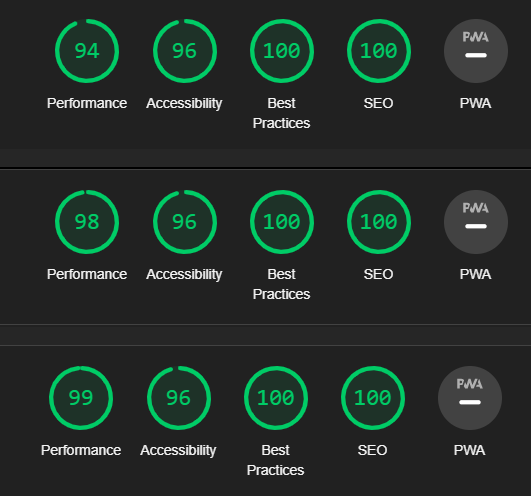
